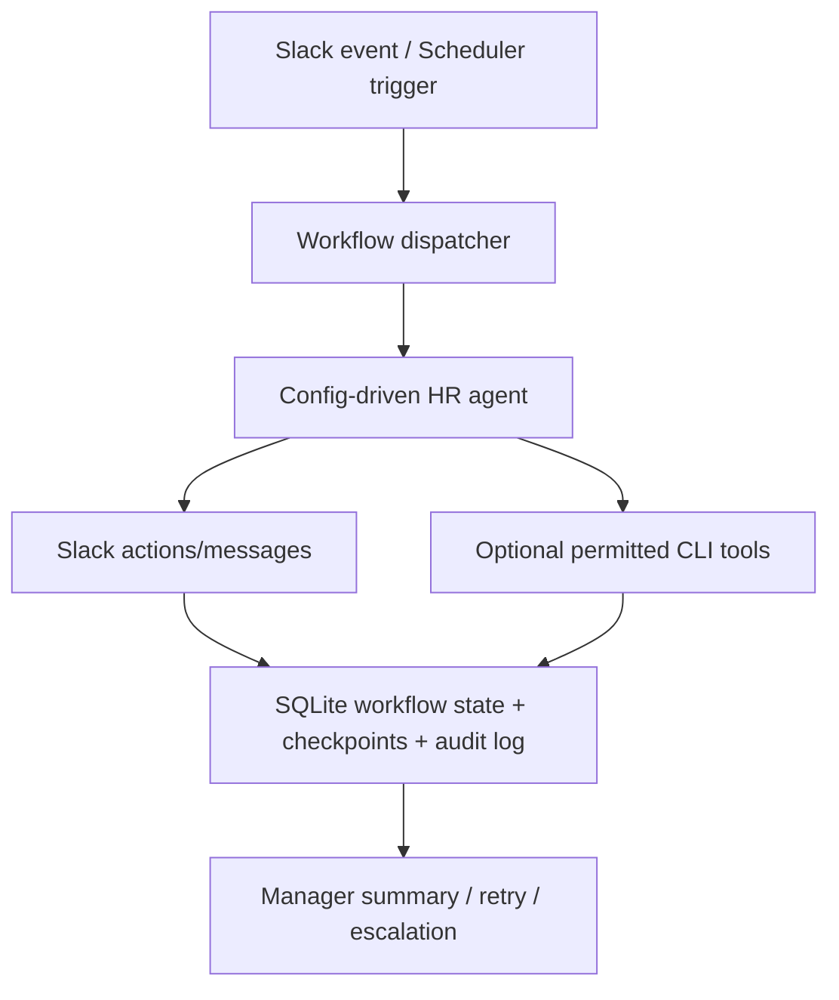

# People Ops Agent Phase 1 Step-by-Step Plan

**Status:** Draft  
**Date:** 2026-04-22  
**Scope:** One reliable Slack-first HR agent on one VM using existing MyClaw seams

## Objective

Ship one `people-ops-agent` with config-driven workflows, durable SQLite state, and controlled Slack operations.  
Phase 1 is a vertical slice, not a platform rewrite.

## Phase 1 Acceptance Criteria

1. Daily check-ins run automatically on schedule.
2. Missing responders receive follow-up messages.
3. Reminder workflows can be scheduled and executed.
4. Manager summaries are generated and sent.
5. A second similar agent can be added mostly by copying config, adjusting permissions, and deploying.

## Fixed Scope and Constraints

### In Scope

1. Runtime model: one Node.js process on one VM.
2. Data model: one SQLite DB.
3. Channel model: one Slack workspace/app.
4. Workflow types: `check-in`, `follow-up`, `reminder`, `summary`.
5. Config-driven behavior through `agent.yaml`, `permissions.yaml`, and workflow files.

### Not In Scope

1. Natural-language workflow compiler.
2. Web UI for workflow/agent authoring.
3. Multi-agent orchestration platform.
4. New infra stack (Temporal/Kafka/Postgres/Redis/event bus/control plane).
5. Container/Kubernetes runtime abstraction for this phase.

## Runtime Flow Diagram



## Step-by-Step Development Plan

### Step 1: Agent Registry From Config

1. Add registry/loading so runtime discovers named agents from files.
2. Initial target: `agents/people-ops-agent/agent.yaml`.
3. Done when `people-ops-agent` boots without hardcoded behavior.
4. Detailed execution doc: `docs/plans/people-ops-step-1-agent-registry.md`.

### Step 2: Permission Profile Layer

1. Load per-agent `permissions.yaml`.
2. Enforce allowed tools, allowed CLIs, allowed Slack destinations, and base rate limits.
3. Done when policy checks run before outbound actions/tool use.

### Step 3: Workflow Definition Schema

1. Introduce minimal schema for recurring workflows with fixed step types.
2. Schema includes trigger, audience selector, timeout, retry policy, summary target, and ordered steps.
3. Done when workflow files validate deterministically at startup.

### Step 4: SQLite Workflow Persistence

1. Add workflow durability tables:
2. `agent_workflows`
3. `workflow_runs`
4. `workflow_checkpoints`
5. `workflow_targets`
6. `workflow_events`
7. `audit_events`
8. Done when definitions, runs, checkpoints, and audit events survive process restart.

### Step 5: Scheduler to Workflow Dispatch

1. Wire `task-scheduler.ts` to enqueue workflow runs by `workflow_id`.
2. Cron triggers produce workflow runs instead of raw prompts.
3. Done when schedule -> run -> persisted state path is stable.

### Step 6: Step Executor for Phase 1 Step Types

1. Implement only:
2. `send_message`
3. `wait_for_reply`
4. `follow_up_if_missing`
5. `post_summary`
6. `write_state`
7. `mark_complete`
8. Done when each step type executes with checkpoint and retry semantics.

### Step 7: Build `people-ops-agent` Workflow Files

1. Add workflow specs under `agents/people-ops-agent/workflows/`:
2. `attendance-daily.yaml`
3. `attendance-followup.yaml`
4. `self-appraisal-reminder.yaml`
5. `manager-summary.yaml`
6. Bind templates under `agents/people-ops-agent/templates/`.
7. Done when all four workflows pass schema validation and can be scheduled.

### Step 8: Operational Logging and Audit Trail

1. Log every outbound action and every workflow transition.
2. Include actor, workflow/run identifiers, target, action, result, timestamp, and correlation id.
3. Done when a full run can be reconstructed from persisted audit records.

### Step 9: Dev Validation

1. Run locally with test Slack workspace/channels and fake roster CSV.
2. Validate daily check-in, missing-response follow-up, reminder schedule, and manager digest.
3. Done when acceptance criteria pass in local dev with repeatable runs.

### Step 10: Staging Rollout

1. Deploy same artifact shape to staging VM with staging Slack app/tokens.
2. Use limited pilot audience.
3. Done when a one-week staging burn-in has no blocker incidents.

### Step 11: Production Launch

1. Promote same artifact/config shape to prod VM.
2. Start with limited pilot group, then expand.
3. Done when pilot week is stable and all acceptance criteria remain green.

## Configuration Layout (Target)

```text
~/myclaw/
  settings.yaml
  .env
  agents/
    people-ops-agent/
      agent.yaml
      permissions.yaml
      prompt.md
      workflows/
        attendance-daily.yaml
        attendance-followup.yaml
        self-appraisal-reminder.yaml
        manager-summary.yaml
      templates/
        checkin.md
        followup.md
        summary.md
```

## Step-by-Step Execution Rule

1. Implement exactly one step at a time in order.
2. Run validation for that step before starting the next step.
3. Do not expand scope without explicitly updating this plan.
