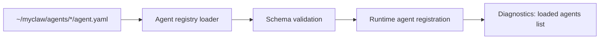

# People Ops Agent Step 1 - Agent Registry From Config

**Status:** Draft  
**Date:** 2026-04-22  
**Parent Plan:** `docs/plans/people-ops-phase1-step-by-step.md`

## Goal

Complete Step 1 by loading agent identity and runtime basics from file config so `people-ops-agent` can boot without hardcoded agent behavior.

## Step 1 Acceptance Criteria

1. Runtime discovers `people-ops-agent` from `~/myclaw/agents/people-ops-agent/agent.yaml`.
2. Agent config is validated at startup with clear failure logs.
3. `people-ops-agent` appears in runtime diagnostics/registration path as config-loaded.
4. No hardcoded `people-ops-agent` behavior remains in startup/registration code.
5. Existing non-HR behavior remains unaffected.

## Scope

### In Scope

1. Agent registry config discovery/loading.
2. Minimal `agent.yaml` schema validation.
3. Startup integration so loaded agents are registered for runtime use.
4. Boot-time diagnostics/logging for loaded agents.

### Out Of Scope (Step 2+)

1. Permissions enforcement from `permissions.yaml`.
2. Workflow parsing/execution.
3. Scheduler-to-workflow dispatch.
4. SQLite workflow persistence changes.

## Step 1 Flow



## Config Contract For Step 1

Use a minimal required shape in `agent.yaml`:

```yaml
id: people-ops-agent
channel: slack
timezone: Asia/Kolkata
manager_target: "slack:#hr-managers"
roster_source: "file:roster/employees.csv"
enabled_workflows:
  - attendance-daily
  - attendance-followup
```

## Capability-Driven Task Breakdown

1. Capability: Discover agent config folders
2. Read `~/myclaw/agents/*/agent.yaml` for each candidate agent folder.
3. Ignore folders without `agent.yaml`.

4. Capability: Validate and normalize config
5. Validate required keys (`id`, `channel`, `timezone`).
6. Normalize optional defaults needed for runtime registration.
7. Fail fast with actionable logs for invalid files.

8. Capability: Build in-memory registry
9. Construct a runtime registry keyed by agent `id`.
10. Enforce duplicate `id` detection at startup.

11. Capability: Wire registry into runtime startup
12. Replace hardcoded agent boot assumptions with registry-driven loading.
13. Register `people-ops-agent` through the same path used for runtime agent setup.

14. Capability: Expose startup observability
15. Log loaded agent ids, source paths, and validation failures.
16. Surface loaded agents in diagnostics output.

## Implementation Notes

1. Reuse current runtime seams already in repo (`runtime-settings.ts`, startup/bootstrap wiring).
2. Keep this as a clean cutover for Step 1 only; do not add dual-path fallback branches.
3. Keep channel scope Slack-first for this phase.

## Validation For Step 1

Run after implementation:

1. `npm run build`
2. `npm test`
3. `python3 .codex/scripts/verify.py`

Manual checks:

1. Place valid `people-ops-agent/agent.yaml` in runtime agents folder.
2. Start runtime and confirm `people-ops-agent` loads from file.
3. Break one required field and confirm startup reports a clear validation error.
4. Restore valid config and confirm runtime loads again.

## Done Checklist

1. Step 1 acceptance criteria all pass.
2. Main plan still unchanged for Step 2+ scope.
3. No workflow, permission, or scheduler behavior is introduced in this step.
