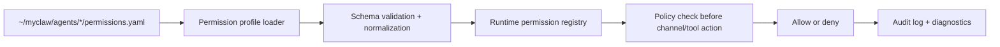

# People Ops Agent Step 2 - Permission Profile Layer

**Status:** Completed  
**Date:** 2026-04-23  
**Completed On:** 2026-04-24  
**Parent Plan:** `docs/plans/people-ops-phase1-step-by-step.md`

## Goal

Complete Step 2 by loading per-agent permission policy from config and enforcing that policy before outbound channel actions or tool execution. Slack is the first channel adapter in Phase 1, but the policy contract must remain channel-agnostic.

## Step 2 Acceptance Criteria

1. Runtime discovers `~/myclaw/agents/<agent>/permissions.yaml` for config-backed agents.
2. Permission config is validated at startup with clear failure logs.
3. Runtime exposes a normalized in-memory permission profile per loaded agent.
4. Outbound tool use and channel sends are checked against the agent permission profile before execution.
5. Base rate-limit settings and allowed channel targets are enforced through one runtime policy path.
6. Missing or invalid permission config fails safely with deny-by-default behavior.

## Scope

### In Scope

1. `permissions.yaml` discovery and loading.
2. Minimal permission schema validation.
3. In-memory permission profile registration keyed by agent id.
4. Enforcement hooks for allowed tools, allowed CLIs, allowed channel destinations, and base rate limits.
5. Diagnostics/logging for loaded permission profiles and rejected actions.

### Out Of Scope (Step 3+)

1. Admin chat flow for permission/tool draft creation.
2. Approval workflow for permission changes.
3. Workflow schema parsing and execution.
4. Scheduler-to-workflow dispatch.
5. Workflow persistence tables.

## Step 2 Flow



## Config Contract For Step 2

Use a minimal required shape in `permissions.yaml`:

```yaml
tools:
  message_send: true
  message_read: true
  bash: false
allowed_clis:
  - gworkspace
require_onecli: true
allowed_channel_targets:
  slack:
    - "#hr-managers"
    - "@hr-manager"
rate_limits:
  messages_per_hour: 80
  summaries_per_hour: 10
```

## Capability-Driven Task Breakdown

1. Capability: Discover permission config files
2. Read `permissions.yaml` for each loaded config-backed agent.
3. Fail safely if the file is missing, unreadable, or malformed.

4. Capability: Validate and normalize policy
5. Validate tool flags, CLI allowlist, channel target rules, and rate-limit fields.
6. Normalize defaults so runtime enforcement stays deterministic.
7. Keep the policy deny-by-default when fields are absent.

8. Capability: Build in-memory permission registry
9. Attach normalized permission profiles to the loaded agent registry.
10. Ensure lookups are keyed by agent id, not folder name.

11. Capability: Enforce before action execution
12. Check channel destinations before sends/posts.
13. Check tool and CLI access before execution.
14. Check rate limits before allowing outbound actions.

15. Capability: Expose observability
16. Log permission profile load success and validation failures.
17. Log denied actions with agent id, target/tool, reason, and timestamp.
18. Surface effective permission profile details in runtime diagnostics where safe.

## Implementation Notes

1. Reuse the Step 1 config-loading pattern so agent and permission discovery feel consistent.
2. Keep enforcement centralized in one runtime policy layer instead of scattering checks across callers.
3. Prefer explicit deny responses over silent skips so operators can debug policy failures quickly.
4. Do not add admin chat authoring in this step; that belongs to Step 3.

## Validation For Step 2

Run after implementation:

1. `npm run build`
2. `npm test`
3. `python3 .codex/scripts/verify.py`

Manual checks:

1. Start runtime with a valid `permissions.yaml` and confirm the profile loads.
2. Attempt an allowed channel action and confirm it passes policy checks.
3. Attempt a blocked channel target or tool and confirm it is denied with a clear log.
4. Reduce a rate limit and confirm repeated sends are blocked once the threshold is hit.
5. Break one required field and confirm startup falls back to safe deny behavior with a clear validation error.

## Done Checklist

1. Step 2 acceptance criteria all pass.
2. Permission enforcement happens before outbound action/tool execution.
3. Denied actions are visible in logs/diagnostics.
4. No workflow authoring, approval flow, or scheduler behavior is introduced in this step.

## Completion Notes

1. Runtime loads `permissions.yaml` for config-backed agents and registers normalized permission profiles.
2. Missing or invalid permission files fall back to deny-by-default profiles with warnings.
3. IPC sends are checked against allowed channel targets before delivery.
4. Agent runner tool use is checked against allowed tools, allowed CLIs, `require_onecli`, and rate limits before approval or execution.
5. Runtime diagnostics expose loaded and invalid permission profile visibility.
6. Local runtime probe confirmed `/Users/caw-dev/myclaw/agents/people-ops-agent/permissions.yaml` loads as a valid `people-ops-agent` profile.
7. Permission schema uses generic `message_*`, `allowed_channel_targets`, and channel-agnostic rate-limit names so Teams or another channel can be added as another platform key instead of a policy rewrite.
